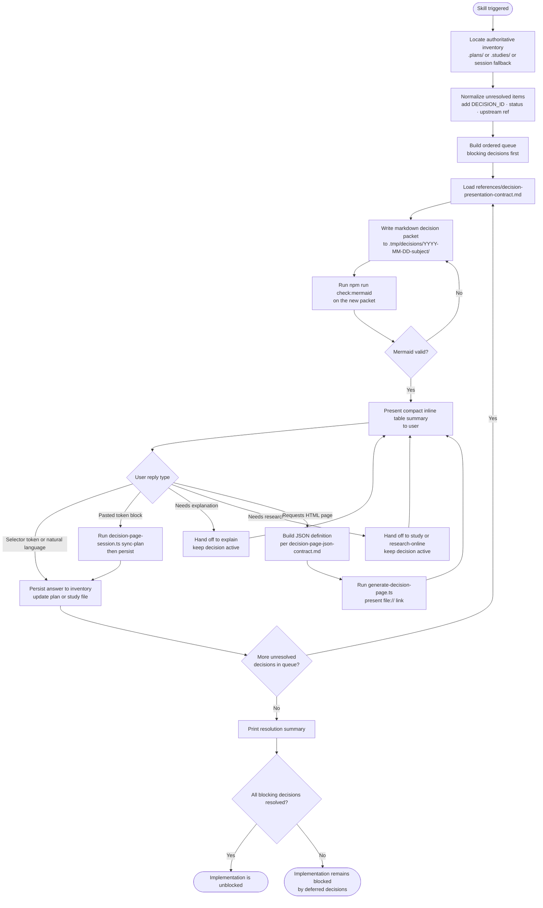

# decisions
Turn unresolved choices into a deterministic one-decision-at-a-time workflow. The skill finds or creates the active decision inventory, writes a structured markdown decision packet to disk, presents the active choice as a compact inline table summary, records the user's answer, and returns a clear unblocked-or-blocked status to the upstream workflow. An interactive HTML page is available only on explicit request.

## Install

The fastest cross-agent install path is the `skills` CLI:

```bash
npx skills add gg-skills/decisions
```

Drop this skill into a workspace as a Git submodule for pinned versions, or as a plain clone for latest `main`:

```bash
# Project-local, version-pinned:
git submodule add git@github.com:gg-skills/decisions.git .claude/skills/decisions

# OR project-local, latest main:
mkdir -p .claude/skills
git -C .claude/skills clone git@github.com:gg-skills/decisions.git

# OR user-level, available in every project on this machine:
mkdir -p ~/.claude/skills
git -C ~/.claude/skills clone git@github.com:gg-skills/decisions.git
```

Restart your agent or reload skills after installation. See the parent [`skills` catalog repo](https://github.com/gg-skills/skills) for the full catalog.

## When to use

- A plan, study, or tracking artifact contains unresolved choices that block implementation.
- A workflow says implementation is blocked pending approval, tradeoff selection, or architecture choice.
- New research introduces alternative approaches that require user direction.
- The user asks for help comparing options before work proceeds.
- The active workflow needs one-decision-at-a-time prompting instead of batched questions.
- The user asks for a dedicated decision page, copied token exports, or interactive choice revision.

**Skip when:** the question is purely informational, the user has already made a clear choice, or a single obvious path exists with no meaningful alternatives.

## How it operates

### Inputs

| Source | Detail |
|--------|--------|
| Active plan file | `.plans/YYYY-MM-DD-<slug>/plan-<slug>-YYYY-MM-DD.md` — scanned for a Decision Register or open-questions section |
| Active study file | `.studies/` — study decision log / open questions handoff |
| Reference contracts | `references/decision-presentation-contract.md` (packet structure, Mermaid Safety Rules, selector-token format) |
| Reference contracts | `references/decision-page-json-contract.md` (JSON schema for interactive page, clipboard payload) |
| User reply | Natural language, selector token (`CHOOSE_DECISION_<ID>_<OPTION>`), pasted token block, or delegation request |
| `package.json` | Queried to verify current npm script names and Mermaid validator version before running commands |

No environment variables are required. No secrets are consumed.

### Outputs

| Artifact | Path | Format |
|----------|------|--------|
| Decision packet | `.tmp/decisions/YYYY-MM-DD-{subject}/` (or inside the active plan/study folder) | Markdown with required Mermaid diagram |
| Inline summary | Printed to the session chat | Compact markdown comparison table |
| Interactive page | Any user-specified path (`--output`) | Self-contained `.html` file (opt-in only) |
| Inventory update | Back to the plan or study file | Persisted choice / status field |

### External commands

| Command | When invoked |
|---------|-------------|
| `npm run check:mermaid -- --files <packet.md>` | After every decision packet is written, to validate Mermaid syntax |
| `npx tsx scripts/generate-decision-page.ts --input <definition.json> --output <page.html>` | Only when the user explicitly asks for the interactive HTML page |
| `npx tsx scripts/decision-page-session.ts prepare --definition-file <definition.json> --output-dir <dir>` | Session helper: prepares page and JSON definition together |
| `npx tsx scripts/decision-page-session.ts sync-plan` | When the user pastes back a token block to sync choices into the plan |
| `npx tsx tests/decision-page-generator.unit.test.ts` | Diagnostic: run before loading reference files when investigating page-generation issues |

### Side effects

- Writes markdown decision packet files to `.tmp/decisions/` (gitignored by default).
- Mutates the active plan or study file to persist the user's chosen option or defer status.
- Generates a local `.html` file when the interactive page is requested.
- No network calls, no git commits, no pushes are initiated by this skill itself.

### Mode toggles

| Mode | How to activate |
|------|----------------|
| Default (inline table summary) | Automatic — no flag needed |
| Interactive HTML page | User says "show me the decision page" or similar explicit request |
| Token-block sync | User pastes a copied token block back into the session |
| Delegation to sibling skill | User says "I need more research" or "explain this first" |

## Operational flow



## Layout

```
decisions/
├── README.md
├── SKILL.md
├── tsconfig.json
├── agents/
│   └── openai.yaml
├── assets/
│   ├── icon-large.png
│   ├── icon-large.svg
│   ├── icon-master.png
│   └── icon-small.svg
├── references/
│   ├── decision-presentation-contract.md
│   └── decision-page-json-contract.md
├── scripts/
│   ├── decision-page-contract.ts
│   ├── decision-page-session.ts
│   └── generate-decision-page.ts
└── tests/
    └── decision-page-generator.unit.test.ts
```

## Quick start

1. A workflow flags a blocked decision — or you call the skill directly: `/decisions`.
2. The skill finds your active `.plans/` or `.studies/` file and normalizes the open items.
3. It writes a decision packet to `.tmp/decisions/YYYY-MM-DD-<subject>/`, validates the Mermaid diagram, and shows you a compact inline table for the first unresolved choice.
4. Reply with a selector token (`CHOOSE_DECISION_AUTH_STRATEGY_JWT`), natural language, or ask for more research.
5. The skill persists your answer, advances to the next decision, and ends with `Implementation is unblocked.` or `Implementation remains blocked by deferred decisions.`

## Resources

- `references/decision-presentation-contract.md` — exact packet structure, section names, Mermaid Safety Rules, selector-token format.
- `references/decision-page-json-contract.md` — JSON schema for the interactive HTML page, `dependsOn` chains, clipboard payload.
- `scripts/generate-decision-page.ts` — CLI for generating the opt-in interactive HTML page.
- `scripts/decision-page-session.ts` — session helper for preparing and syncing decision pages.
- `tests/decision-page-generator.unit.test.ts` — unit tests; run these first when diagnosing page-generation issues.

## Caveats

- **One decision at a time.** The skill never batches multiple choices into a single prompt — this is intentional.
- **HTML page is opt-in.** The default output is a compact markdown table. The interactive page is only generated when explicitly requested.
- **Mermaid validation is mandatory.** Every packet is validated with `npm run check:mermaid` before presentation. A single syntax error (unquoted label with parentheses or colons) will loop back to a rewrite.
- **Selector tokens are strict.** Tokens must follow `CHOOSE_DECISION_<DECISION_ID>_<OPTION_NAME>` exactly — no abbreviations.
- **Answers must be persisted immediately.** Chat history is not treated as durable storage; the outcome is written back to the plan or study file before advancing.
- **Snapshot age:** SKILL.md was authored 2026-04-30. Verify npm script names and Mermaid validator CLI flags against the current `package.json` before relying on bundled guidance.
