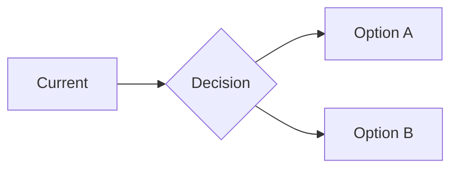

> **Snapshot age:** authored 2026-04-30. Verify release-sensitive answers with current npm scripts
> and package versions before responding with high confidence.

# GG → Decisions → Decision Packets

## Overview

Use this skill to turn unresolved user choices into a deterministic decision workflow. It finds or
creates the active decision inventory, writes a detailed markdown decision packet to disk, presents
the active choice back to the user as a compact table-based inline summary by default, records the
user's answer, and returns a clear unblock-or-blocked status to the upstream workflow. The
interactive decision page remains available only when the user explicitly asks for it.

For a direct command lookup, see [Quick Commands](#quick-commands) below.

## When to Use This Skill

**TRIGGER when:**
- A plan, study, or tracking artifact contains unresolved choices that block implementation.
- A workflow says implementation is blocked pending approval, tradeoff selection, or architecture
  choice.
- New research introduces alternative approaches that require user direction.
- The user asks for help comparing options before work proceeds.
- The active workflow needs one-decision-at-a-time prompting instead of batched questions.
- The user asks for a dedicated decision page, copied token exports, or interactive choice
  revision.

**SKIP when:**
- The question is purely informational with no commitment required.
- The user has already made a clear choice and only needs execution.
- A single obvious path exists with no meaningful alternatives.

## Common Misconceptions

| # | Misconception | Correction | Key concept |
|---|---------------|------------|-------------|
| 1 | The interactive HTML page is the default output. | The default is a compact inline table summary; the HTML page is opt-in only. | Default path vs opt-in path |
| 2 | All decisions can be presented at once in a batch. | This skill presents exactly one unresolved decision at a time, in order. | One-decision-at-a-time |
| 3 | Decision packets can be reconstructed from memory. | Every packet must follow the exact contract in `references/decision-presentation-contract.md`. | Contract-driven output |
| 4 | Mermaid diagrams are optional in decision packets. | Every packet must include at least one Mermaid diagram following the safety rules. | Visual requirement |
| 5 | The user's natural-language answer does not need persistence. | Every answer must be persisted back to the authoritative inventory immediately. | Durability |
| 6 | Any token format is acceptable for decision choices. | Tokens must follow `CHOOSE_DECISION_<ID>_<OPTION>` exactly. | Token consistency |
| 7 | Decision options can be vague if context is clear. | Each option must have concrete code/diff, pros, cons, and impact. | Option concreteness |
| 8 | Exploratory paths are optional for commitment decisions. | Every packet must include `STUDY_OPTIONS`, `RESEARCH_OPTIONS`, and `DEEPENING_OPTIONS` first. | Exploratory-first |

## Quick Commands

```bash
# Validate Mermaid diagrams in a decision packet
npm run check:mermaid -- --files <decision-packet.md>

# Generate the interactive decision page from a JSON definition
npx tsx skills/decisions/scripts/generate-decision-page.ts --input <definition.json> --output <page.html>

# Run the full decision page test suite
npx tsx skills/decisions/tests/decision-page-generator.unit.test.ts

# Session helper: prepare page and definition together
npx tsx skills/decisions/scripts/decision-page-session.ts prepare --definition-file <definition.json> --output-dir <dir>

# Check decision packet completeness (14-item checklist)
npx tsx skills/decisions/scripts/check-decision-completeness.ts --latest
npx tsx skills/decisions/scripts/check-decision-completeness.ts --packet <path.md>
npx tsx skills/decisions/scripts/check-decision-completeness.ts --latest --json
```

For full command surface, see `references/decision-page-json-contract.md`.

## Decision Quality Checklist

Use this checklist before presenting any decision packet. Each item is a gate—the decision is not ready until all required items are satisfied.

| # | Checklist Item | Why It Matters | Gate |
|---|---------------|---------------|------|
| 1 | **Decision clarity** — The decision states a single clear choice with context | Prevents confused choices | Pre-draft |
| 2 | **Status declared** — Current status (open/answered/deferred/blocked) is explicit | Enables tracking | Pre-draft |
| 3 | **Upstream artifact linked** — Source plan or study path is referenced | Enables traceability | Pre-draft |
| 4 | **Options concrete** — Each option has code/diff, pros, cons, and impact | Enables informed choice | Draft |
| 5 | **Exploratory paths included** — STUDY/RESEARCH/DEEPENING options precede commitment | Prevents premature commitment | Draft |
| 6 | **Mermaid diagram present** — At least one valid diagram following safety rules | Enables visual understanding | Draft |
| 7 | **Diagram validated** — `npm run check:mermaid` passes without errors | Prevents broken renders | Draft |
| 8 | **Token format correct** — All tokens follow `CHOOSE_DECISION_<ID>_<OPTION>` | Enables programmatic selection | Draft |
| 9 | **Blocking status declared** — Whether decision blocks implementation is explicit | Enables planning gate | Draft |
| 10 | **Impact surface documented** — Affected files, systems, tests are listed | Enables scope awareness | Draft |
| 11 | **Recommended option stated** — Recommendation with evidence is provided | Provides guidance | Closeout |
| 12 | **Inline summary compact** — Table has concrete identifiers, not abstract prose | Enables fast scanning | Closeout |
| 13 | **Answer persistence path clear** — How to persist the answer is documented | Enables durability | Closeout |
| 14 | **Next decision queued** — Next unresolved decision is identified | Enables flow | Closeout |

### Quality Tiers

| Tier | Criteria | Use When |
|------|----------|----------|
| **Minimal** | Items 1, 2, 4, 8 | Simple choice, no blocking |
| **Standard** | Items 1-10, 11 | Multi-option decision with evidence |
| **Full** | All 14 items | Complex decision with blocking impact |

### Pre-Presentation Verification

Before presenting a decision, verify:

```
□ Decision is clear and singular
□ Status is declared (open/answered/deferred/blocked)
□ Upstream artifact linked
□ At least 2 options with concrete pros/cons/impact
□ Exploratory paths included (STUDY/RESEARCH/DEEPENING)
□ Mermaid diagram present and validated
□ Token format correct (CHOOSE_DECISION_<ID>_<OPTION>)
□ Blocking status declared
□ Impact surface documented
□ Recommended option stated with evidence
□ Inline summary is compact and scannable
□ Answer persistence path is clear
□ Next decision is queued
```

## Decision Consistency Validator

Before presenting a decision, run these consistency checks. A decision that fails any check must be fixed before presentation.

### Consistency Check Matrix

| Check | What to Verify | How to Fix |
|-------|---------------|------------|
| **Options vs Pros/Cons** | Every option has corresponding pros and cons | Add missing pros/cons |
| **Pros/Cons vs Impact** | Pros/cons align with stated impact | Verify impact is consistent |
| **Recommendation vs Evidence** | Recommendation has supporting evidence | Add evidence or qualify recommendation |
| **Mermaid vs Options** | Diagram reflects all options in the decision | Update diagram |
| **Token vs Options** | Each token matches exactly one option name | Fix token format |
| **Blocking vs Upstream** | Blocking status matches plan/study intent | Clarify with upstream |
| **Impact vs Files** | Impact list matches affected systems | Add missing files |
| **Exploratory vs Commitment** | Exploratory paths precede commitment paths | Reorder options |
| **Status vs History** | Status matches prior decisions in inventory | Update status or history |
| **Next vs Queue** | Next decision is actually next in priority | Reorder queue |

### Red Flags (Never Present)

A decision with any of these must be fixed before presenting:

- [ ] Option without any pros or cons
- [ ] Recommendation without supporting evidence
- [ ] Token format does not match `CHOOSE_DECISION_<ID>_<OPTION>`
- [ ] Mermaid diagram fails validation
- [ ] Contradictory statements in different options
- [ ] Blocking decision without clear resolution path

## Non-Negotiable Policy

1. Always identify the authoritative decision inventory in the active plan or study before prompting
   the user.
2. Never reconstruct decision packet structure, CLI flags, or presentation format from memory --
   always read the relevant reference contract first.
3. Default to the markdown decision packet artifact for every decision. The packet must follow
   `references/decision-presentation-contract.md`, be written to a file, and remain the detailed
   source of truth. Present a compact table-based inline summary unless the user explicitly asks for
   the full packet inline or the interactive page.
4. Only generate the interactive HTML page when the user explicitly requests it. When they do,
   present it as a clickable `file://` link with a plain-English summary of the decisions it
   resolves.
5. `CHOOSEABLE_OPTIONS` must always list the recommended option first. Every option must include
   description, pros, cons, concrete code or pseudo-diff, a Mermaid diagram, and impact notes.
   Present exploratory paths (`STUDY_OPTIONS`, `RESEARCH_OPTIONS`, `DEEPENING_OPTIONS`) before
   commitment paths.
6. Every markdown decision packet must include a Mermaid diagram following the safety rules in
   `references/decision-presentation-contract.md`. Validate diagrams with
   `npm run check:mermaid -- --files <packet.md>` after writing.
7. Load only the subset of `references/` the task requires. Do not read every file by default.
8. Persist the chosen option or defer state back to the authoritative inventory immediately. If a
   blocking decision is deferred, continue immediately to the next unresolved decision without
   waiting. For any answer about validator versions, CLI flags, npm scripts, or bundled tool
   behavior: treat the guidance as likely stale and verify against current `package.json` or the
   research skill before stating specifics.

## Quick Decision Guide

| Scenario | Recommended path | Why |
|----------|-----------------|-----|
| User needs to choose between implementation options | Markdown packet + inline table summary | Default; durable; concrete |
| User explicitly asks for interactive page | JSON definition -> `generate-decision-page.ts` | Opt-in only; richer UX |
| User pastes back a token block | `decision-page-session.ts sync-plan` | Keeps plan and structured source aligned |
| User wants simpler visual explanation before choosing | Hand off to `explain/SKILL.md` | Lower cognitive load |
| User needs more evidence before choosing | Hand off to `study/SKILL.md` or `research-online/SKILL.md` | Evidence-first |

**Rule of thumb:** Default to the markdown packet and inline table summary; escalate to the
interactive page only on explicit request.

## Decision Inventory Normalization

Before presenting a decision, normalize the inventory in this order:

1. Active `.plans/YYYY-MM-DD-task-name-slug/plan-<slug>-YYYY-MM-DD.md`:
   - use the existing decision/open-questions section when present,
   - otherwise add a `Decision Register` section.
2. Active study under `.studies/`:
   - use the study's decision log / open questions handoff,
   - keep the study as evidence and route the user-facing decision packet through this skill.
3. Session-only fallback:
   - if no durable artifact exists yet, create a session decision register and explicitly note which
     downstream artifact must be updated once the user answers.

Normalize each unresolved item with:
- a verbose `DECISION_ID`,
- current status (`open`, `answered`, `deferred`, `blocked`),
- the exact upstream artifact path/URL/section reference,
- the recommended option if one already exists,
- impacted files, systems, tests, and follow-up skills,
- whether the decision blocks implementation immediately.

After normalization, materialize the queue as a markdown decision packet per
`references/decision-presentation-contract.md`. Write the packet under
`.tmp/decisions/YYYY-MM-DD-{subject}/` unless an active study or plan
already defines a better artifact location.

## One-Decision Interaction Loop

1. Build an ordered queue of unresolved decisions, with blocking items first.
2. Write a markdown decision packet per `references/decision-presentation-contract.md` for the
   active decision, validate its Mermaid diagrams, and present a compact inline table summary.
3. Only if the user explicitly asks for the interactive page: build JSON per
   `references/decision-page-json-contract.md` and generate it with
   `npx tsx skills/decisions/scripts/decision-page-session.ts prepare ...` or
   `npx tsx skills/decisions/scripts/generate-decision-page.ts ...`. Present as a clickable `file://` link with a plain-English
   summary.
4. Wait for the user reply.
5. Support reply modes: direct token, pasted token block, natural language, clarifying questions,
   request for study/research/explanation.
6. If the user requests simpler explanation: keep decision active, route to
   `explain/SKILL.md`, then return.
7. If the user requests more study or research: keep decision active, route to
   `study/SKILL.md` or `research-online/SKILL.md`, then return.
8. After a choice is made, persist the outcome back to the authoritative inventory.
9. Continue immediately to the next unresolved decision.
10. End with a short resolution summary and one of:
    - `Implementation is unblocked.`
    - `Implementation remains blocked by deferred decisions.`

## Reference Loading by Task Type

| Task type | Load these files | Skip |
|-----------|-----------------|------|
| Formatting a markdown decision packet | `references/decision-presentation-contract.md` | `references/decision-page-json-contract.md` |
| Building an interactive decision page | `references/decision-page-json-contract.md` | `references/decision-presentation-contract.md` |
| Validating Mermaid diagrams in a packet | `references/decision-presentation-contract.md` (Mermaid Safety Rules) | `references/decision-page-json-contract.md` |
| Syncing token blocks back to a plan | `references/decision-page-json-contract.md` (Clipboard Payload) | `references/decision-presentation-contract.md` |
| Diagnostic / inspection-first | Run `npm run check:mermaid -- --files <packet.md>` and `npx tsx skills/decisions/tests/decision-page-generator.unit.test.ts` before loading files | -- |

For diagnostic requests, run the inspection commands first before loading any reference files. Load
only the subset the task needs.

## Cross-Skill Coordination

- `plan/SKILL.md` -- use when execution decisions remain unresolved before
  implementation continues.
- `study/SKILL.md` -- hand off study-derived open questions and recommendation
  tradeoffs when the user must choose a direction.
- `explain/SKILL.md` -- use when the options are valid but the current decision
  surface is too dense for confident user comprehension.
- `research-online/SKILL.md` -- use when current external docs, standards, or product
  behavior must be checked before the user can choose confidently.
- the `documentation-sync` workflow -- use after a decision changes contracts, behavior,
  or guidance that must be documented.
- `specs/SKILL.md` -- use when decision resolution reveals new issues or
  improvement opportunities that need investigation-ready specs.

## Decision Generation Template

Use this template when presenting a decision to the user. Fill in each section with specific content.

### Decision Packet Structure

```markdown
# Decision: [Clear decision statement]
**Decision ID:** DECISION_<ID>
**Status:** [open | answered | deferred | blocked]
**Quality Tier:** [Minimal | Standard | Full]
**Upstream:** [Plan/study path]
**Blocks Implementation:** [Yes | No]

## Context
[Why this decision must be made now]

## Options

### Exploratory Paths
- `STUDY_OPTIONS`: Conduct further study before deciding
- `RESEARCH_OPTIONS`: Research external best practices
- `DEEPENING_OPTIONS`: Gather more evidence or analysis

### Commitment Options
#### Option A: [Name]
- **Description:** One clear sentence
- **Pros:** Bullet list of advantages
- **Cons:** Bullet list of disadvantages
- **Code/Diff:** ```[pseudo]code or diff```
- **Impact:** Affected files, systems, tests

#### Option B: [Name]
[Same structure]

## Recommendation
**[Option A]** is recommended because [evidence-based reason].

## Mermaid Diagram


## CHOOSEABLE_OPTIONS
- `CHOOSE_DECISION_<ID>_OPTION_A` (Recommended): Choose Option A
- `CHOOSE_DECISION_<ID>_OPTION_B`: Choose Option B
- `STUDY_OPTIONS`: Conduct further study first
- `RESEARCH_OPTIONS`: Research external best practices first
- `DEEPENING_OPTIONS`: Gather more evidence first

## Next
**Following decision:** [Next decision ID or "None"]
```

### Token Format Rules

| Token | Meaning |
|-------|--------|
| `CHOOSE_DECISION_<ID>_OPTION_A` | Select Option A |
| `CHOOSE_DECISION_<ID>_OPTION_B` | Select Option B |
| `STUDY_OPTIONS` | Study more before deciding |
| `RESEARCH_OPTIONS` | Research before deciding |
| `DEEPENING_OPTIONS` | Gather more evidence |

### Option Completeness Checklist

For each option, verify:
```
□ Description is one clear sentence
□ At least 2 pros listed
□ At least 2 cons listed
□ Code/diff is concrete (not vague)
□ Impact lists specific files/tests/systems
□ Mermaid diagram reflects the options
□ Token format matches (CHOOSE_DECISION_<ID>_<OPTION>)
```

## Common Pitfalls

1. **Generating the HTML page by default.** This happens when the agent assumes richer UX is always
   better. The correct approach is to default to the markdown packet and inline table summary unless
   the user explicitly asks for the page. See `references/decision-presentation-contract.md`.
2. **Skipping Mermaid validation.** This happens when the agent trusts diagrams written from memory.
   A single syntax error breaks the entire render. Always run
   `npm run check:mermaid -- --files <packet.md>` after writing. See
   `references/decision-presentation-contract.md` Mermaid Safety Rules.
3. **Presenting multiple decisions at once.** This happens when the agent tries to be efficient by
   batching. This skill resolves exactly one decision at a time to keep each choice focused.
   Batching defeats the purpose.
4. **Forgetting to persist the answer.** This happens when the agent treats chat history as durable.
   The correct approach is to write the choice back to the plan or study immediately using the
   inventory normalization path.
5. **Using ambiguous selector tokens.** This happens when the agent invents short tokens for
   convenience. Tokens must follow `CHOOSE_DECISION_<DECISION_ID>_<OPTION_NAME>` exactly. See
   `references/decision-presentation-contract.md`.
6. **Omitting exploratory paths.** This happens when the agent rushes to implementation options.
   Every packet must include `STUDY_OPTIONS`, `RESEARCH_OPTIONS`, and `DEEPENING_OPTIONS` before
   `CHOOSEABLE_OPTIONS`. See `references/decision-presentation-contract.md`.

## Troubleshooting

| Symptom | Likely cause | Fix |
|---------|-------------|-----|
| Mermaid validation fails with "Syntax error in text" | Unquoted node label containing parentheses, colons, or backticks | Quote every label with `["..."]` and remove markdown syntax inside labels. See `references/decision-presentation-contract.md`. |
| Generated HTML page shows no decisions | JSON definition missing `decisions` array or all decisions filtered by `dependsOn` | Validate the definition with `npx tsx skills/decisions/tests/decision-page-generator.unit.test.ts` and check `dependsOn` chains. |
| Token block sync fails with "unknown decision token" | Token in the pasted block does not match any option in the definition | Verify the token spelling matches `CHOOSE_DECISION_<DECISION_ID>_<OPTION_NAME>` exactly. |
| Inline summary is too long for terminal scanning | Comparison table has too many rows or abstract cells | Abbreviate aggressively; move detail to the packet file; keep only concrete identifiers and consequences. |
| User cannot choose from the inline summary alone | Cells lack exact identifiers, file names, or behavior changes | Add concrete mechanism or affected surface plus practical consequence to each cell. |

## Temporary Files

Place temporary files under `.tmp/decisions/YYYY-MM-DD-{subject}/`. The root
`.tmp/` directory is already gitignored. Do not create top-level dotfile temp directories.

## Local Corpus Layout

The `references/` directory contains 2 flat files (no subfolders):

- `references/decision-presentation-contract.md` -- Exact output structure for the markdown fallback
  packet, section names, selector-token rules, required follow-up options, and Mermaid Safety Rules.
- `references/decision-page-json-contract.md` -- JSON definition schema for the interactive decision
  page, dependency and invalidation rules, and summary-plus-tokens clipboard contract.

## Guidance Alignment

- Apply repository guidance consistently with `AGENTS.md`, `CLAUDE.md`, and `GEMINI.md`.
- If this skill file is updated, run `npm run skills:sync` so IDEs pick up the new version
  immediately.
- If guidance semantics changed, run the `agents-sync` workflow before workflow
  closure.
- Snapshot verified: 2026-04-30. Verify Mermaid validator versions, CLI behavior, and npm script
  names against current `package.json` before relying on bundled guidance.
